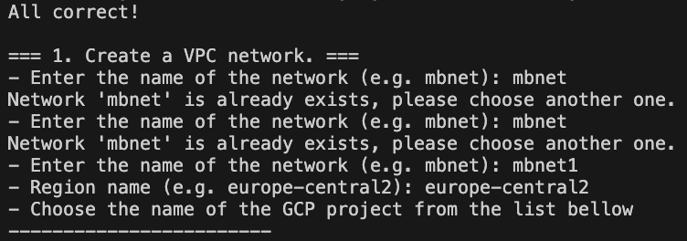
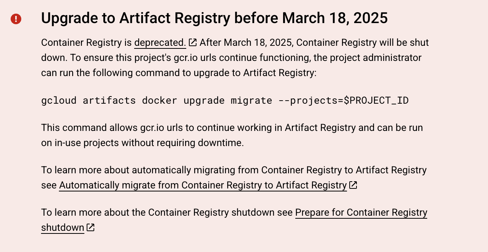
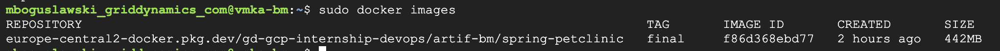
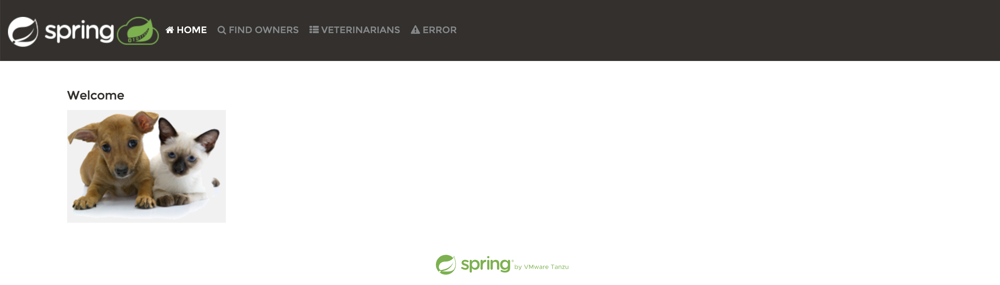

# GCP Practical Task

**Notice:**
This task is aimed at practicing the use of the **gcloud** CLI tool, not bash scripting skills. The script `infra_setup.sh` does not cover every possible error scenario, so please provide only the information requested.

## Write one or several bash scripts (using gcloud CLI) which:

The script is designed with users in mind — just run it and follow the instructions step-by-step.

<p align="center">  </p>

Make the script `infra_setup.sh` executable and run it::

```bash
chmod +x infra_setup.sh
./infra_setup.sh
```

This script will guide you through the following steps:

* Check gcloud installation
* Create VPC and subnet
* Create firewall rules
* Create Docker Artifact Registry
* Prepare local Docker image
* Push image to Artifact Registry
* Create VM instance
* Access the deployed app


Since Google Container Registry (GCR) is now deprecated:
<p align="center">  </p>


I chose to use **Artifact Registry** instead.

By default, the VM is assigned an ephemeral external IP address during creation, so no explicit external IP setup is required.


---

## Results

The image is successfully pulled on the VM:

<p align="center">  </p>


Accessing the app via address like `http://35.36.37.38:8080/` shows the Spring app running:

<p align="center">  </p>


**Note:**
Remember to create a firewall rule to allow access to this VM. For example, use the source IP range `0.0.0.0/0` with `ALLOW` for all ports and protocols.
